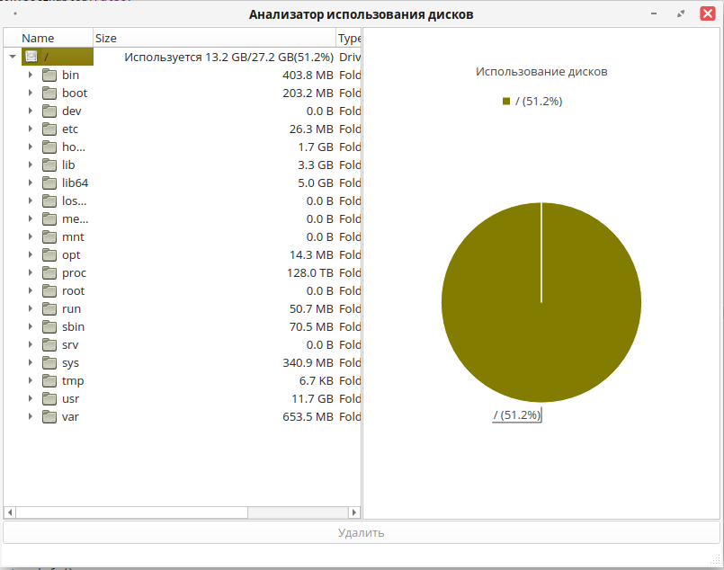
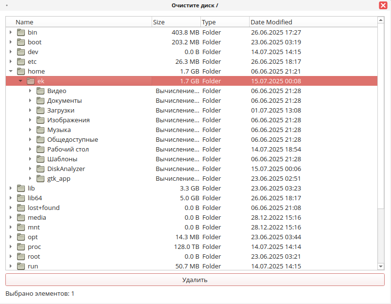

Команды для установки

# 1. Установка зависимостей

sudo dnf install python3-pip python3-devel qt6-qtbase-devel

# 2. Установка PySide6 для пользователя
#не обращаем внимание на ошибки, если в конце успешная установка или библиотека уже установлена

python3 -m pip install --user PySide6

# 3. Добавление пути в переменную окружения

echo 'export PYTHONPATH=$HOME/.local/lib/python3.11/site-packages:$PYTHONPATH' >> ~/.bashrc
source ~/.bashrc

# 4. Установка вашего пакета с игнорированием зависимостей

sudo rpm -ivh --nodeps https://github.com/VinskiyL/DiskAnalyzer/releases/download/v1.0/disk-analyzer-1.0-1.red80.noarch.rpm

Рисунок 1: Главное окно

Рисунок 2: Окно очистки

